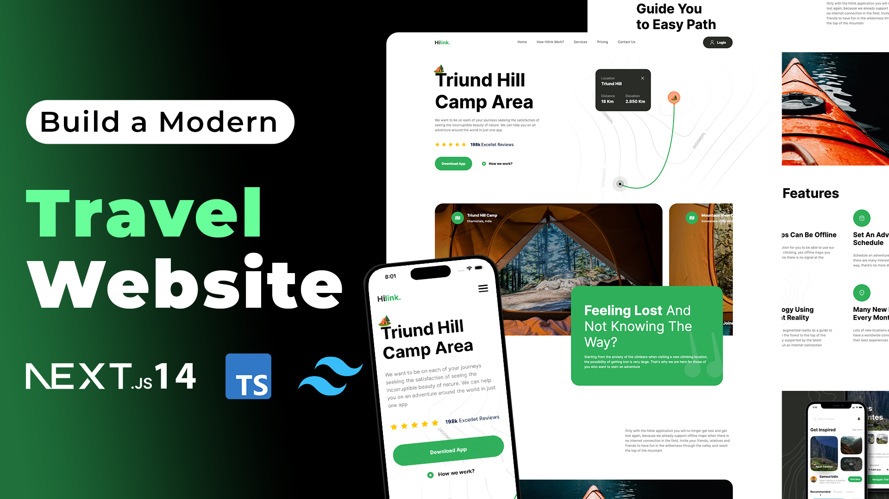

## Travel Website

The Fully Responsive Modern UI/UX Travel Website, developed with Next.js 14, Tailwind CSS, and TypeScript, exemplifies cutting-edge web development practices. This project combines the power of Next.js for server-side rendering with the utility-first approach of Tailwind CSS and the type safety of TypeScript to create a visually stunning and highly functional travel website.

This project not only showcases a visually appealing user interface but also prioritizes responsiveness, ensuring a seamless browsing experience across various devices and screen sizes. With modern UI/UX design principles incorporated throughout, this travel website sets a high standard for user engagement and satisfaction in the online travel industry.

Youtube Tutorial Link: https://youtu.be/2Lng9i5L4HY

  

    
    
    
  

  <h3 align="center">Travel Website</h3>

   

     Build this project step by step with our detailed tutorial on <a href="https://www.youtube.com/@constGenius" target="_blank"><b>constGenius</b></a> YouTube. Join the Genius family!
    

